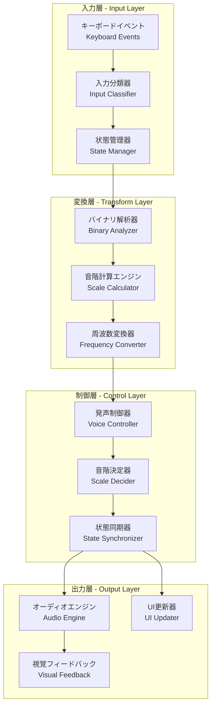
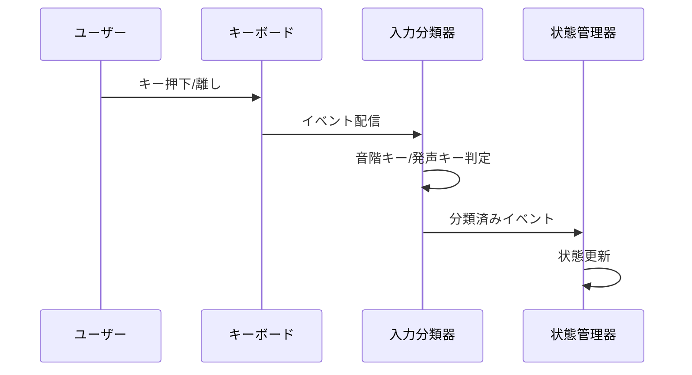
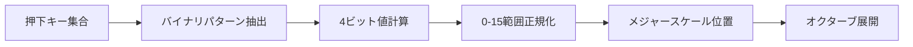
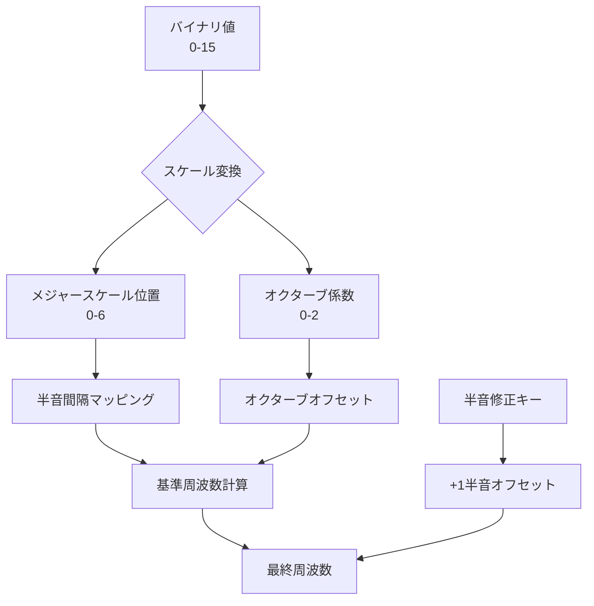
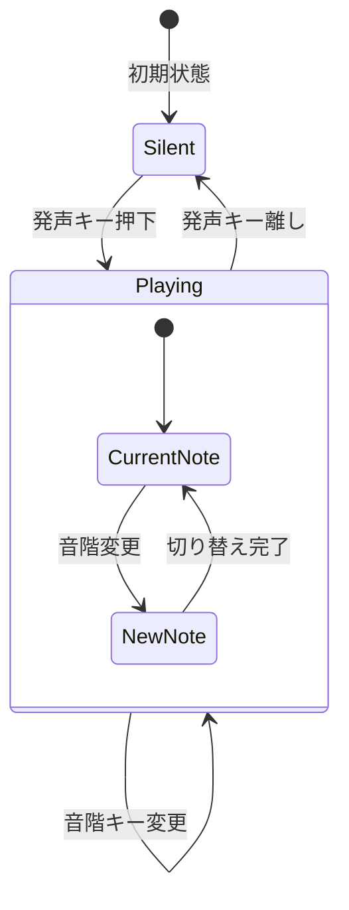
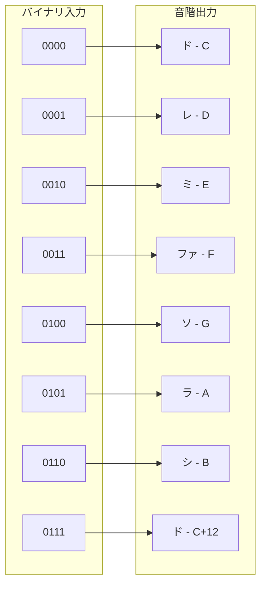
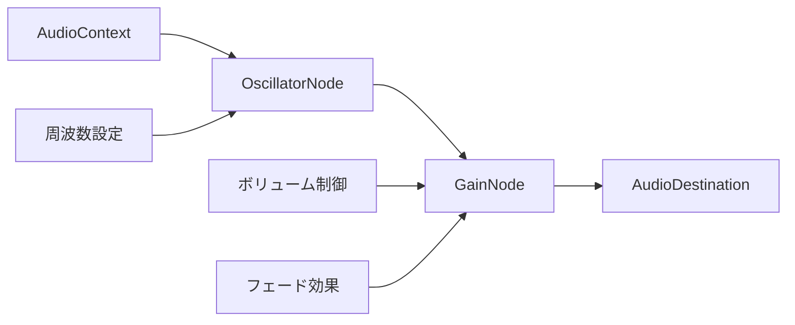
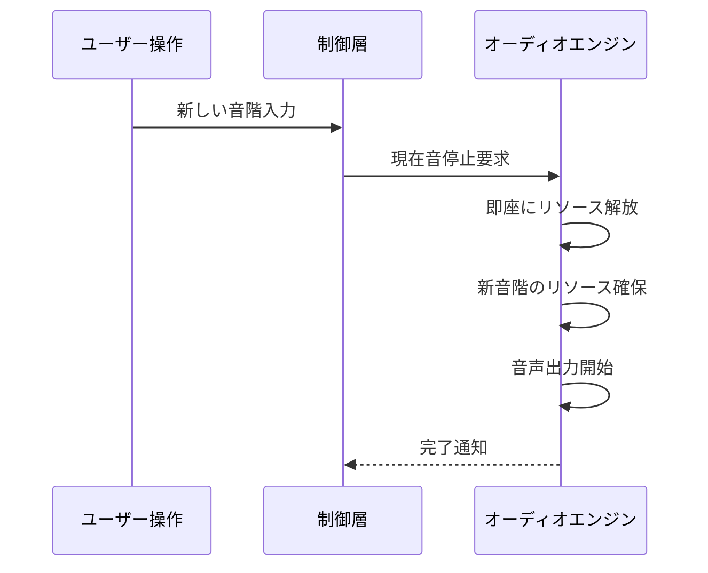
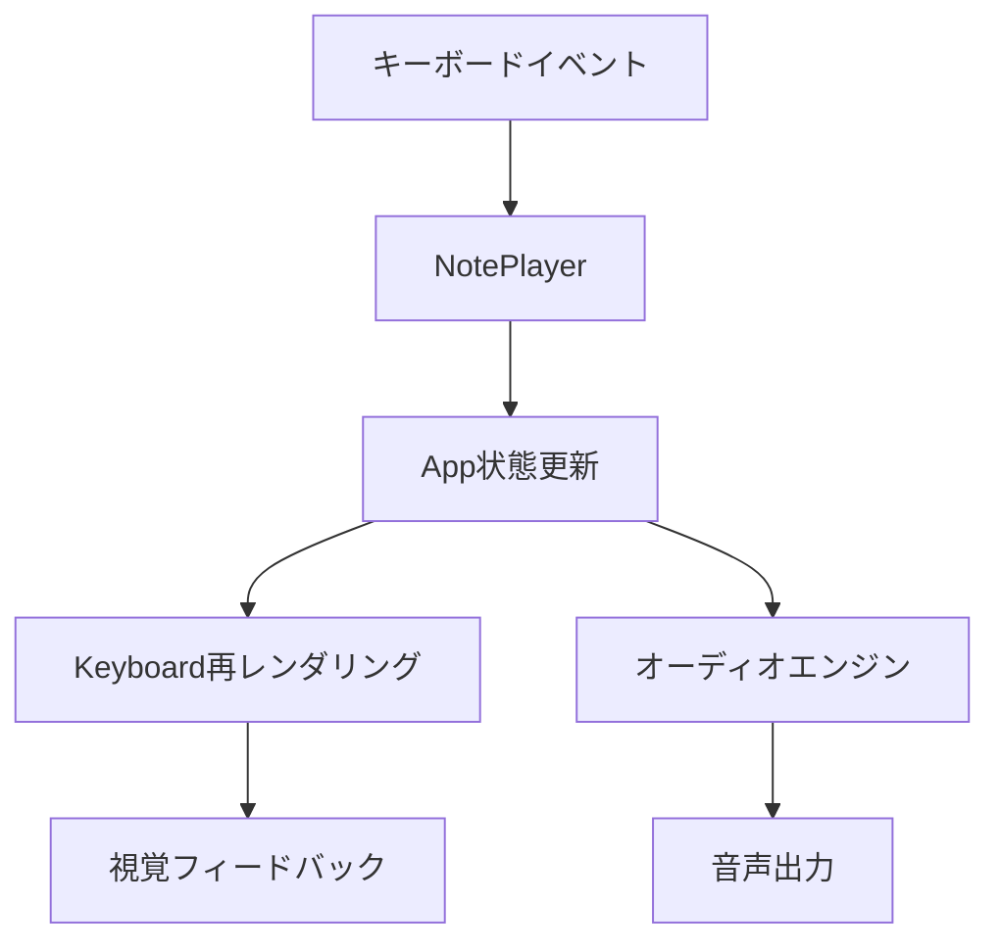
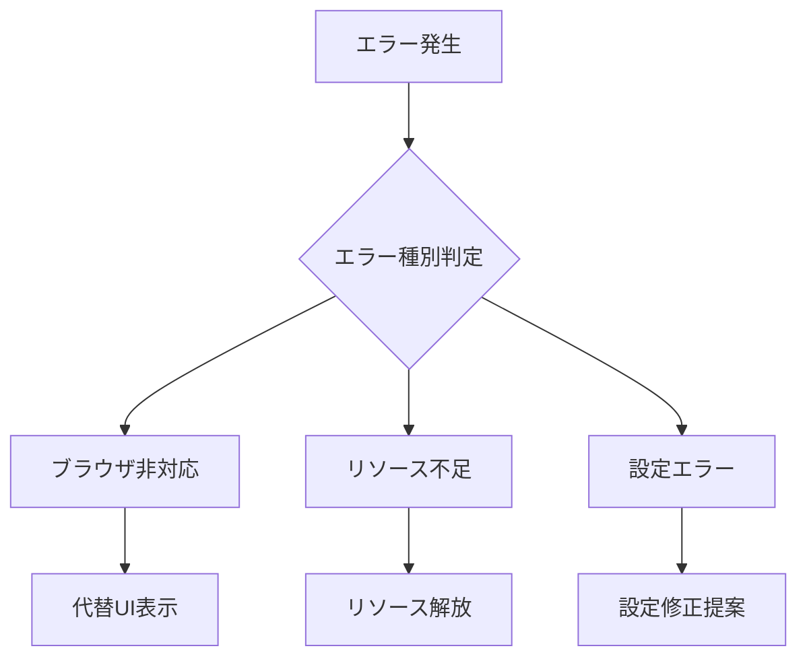

# デジタル楽器 - 技術アーキテクチャ仕様

## システム概要

このドキュメントでは、デジタル楽器システムの技術アーキテクチャを抽象的かつ包括的に説明します。バイナリ入力から音声出力までの処理フローと、各層の責任・設計原則を明確化します。

## 🏗️ アーキテクチャ概要



## 🎯 設計原則

### 分離された責任
- **入力処理**: ハードウェアイベントの正規化と分類
- **数学的変換**: バイナリ値から音階への純粋な変換
- **状態制御**: 発声タイミングと音階切り替えの制御
- **出力生成**: 音声・視覚フィードバックの生成

### 純粋関数アプローチ
- **変換処理**: 副作用なしの計算ロジック
- **予測可能性**: 同じ入力に対して常に同じ出力
- **テスト容易性**: 単体テストでの検証が容易

### 型安全性
- **厳密な型定義**: TypeScriptによる完全な型保証
- **エラー防止**: コンパイル時での不正操作の検出
- **インターフェース契約**: 各層間の明確な契約定義

## 🔄 処理フロー概念

### 1. 入力捕捉フェーズ



**責任と設計**:
- **グローバルイベント捕捉**: ウィンドウレベルでの包括的なキー監視
- **正規化処理**: 大文字小文字、特殊キーの統一処理
- **重複除去**: キーリピートイベントの適切な処理

### 2. バイナリ解析フェーズ



**概念的処理**:
- **ビットマスキング**: 特定キー群からの効率的な値抽出
- **基数変換**: キー組み合わせからの数値変換
- **範囲制約**: 定義域内での値の保証

### 3. 音階変換フェーズ



**数学的変換**:
- **モジュロ演算**: 7音スケール内での循環位置計算
- **除算計算**: オクターブ階層の決定
- **周波数計算**: 12音律基準での正確な周波数導出

### 4. 発声制御フェーズ



**制御ロジック**:
- **条件分岐**: 発声キー状態による動作切り替え
- **優先制御**: 複数キー同時押下時の適切な処理
- **状態一貫性**: 音声出力とUI表示の同期保証

## 🎵 音階システム詳細

### メジャースケールマッピング



### 周波数計算アルゴリズム

**基本公式**:
```
周波数 = 基準周波数 × 2^(半音オフセット/12)
```

**計算要素**:
- **メジャースケール間隔**: `[0, 2, 4, 5, 7, 9, 11]` 半音
- **オクターブオフセット**: `Math.floor(値 / 7) × 12` 半音
- **半音修正**: スペースキー押下時 `+1` 半音

## 🔊 オーディオエンジン設計

### Web Audio API活用



**技術的特徴**:
- **低レイテンシー**: ハードウェア最適化された音声処理
- **高精度**: 浮動小数点数での正確な周波数制御
- **エフェクト**: フェードイン/アウトによる自然な音の切り替え

### 競合状態対策



**安全性保証**:
- **原子的操作**: リソース状態の一貫性保証
- **参照管理**: 適切なライフサイクル管理
- **例外処理**: 異常状態での安全な復旧

## 🎨 UI状態管理

### React状態同期



**状態管理原則**:
- **単一情報源**: アプリケーション状態の一元管理
- **不変性**: 状態更新における副作用の排除
- **予測可能性**: 状態変更の明確な追跡可能性

## 🚀 パフォーマンス設計

### メモリ効率性
- **シングルトンパターン**: AudioContextの効率的な再利用
- **適切なライフサイクル**: リソースの確実な解放
- **参照最適化**: 不要なオブジェクト生成の回避

### レスポンス性能
- **非同期処理**: UIブロッキングの回避
- **イベント最適化**: 効率的なイベント処理
- **レンダリング最適化**: 必要最小限の再描画

## 🔮 拡張性設計

### プラグイン可能なアーキテクチャ
- **音階システム**: 異なる音律体系への対応可能性
- **入力方法**: キーボード以外の入力デバイス対応
- **出力形式**: MIDI出力、録音機能の追加可能性

### 設定ドリブン設計
- **キーマッピング**: 実行時でのカスタマイズ
- **音響設定**: 音色、エフェクトの動的変更
- **UI設定**: 表示形式、レイアウトの柔軟性

## 🔧 エラーハンドリング戦略

### 型安全なエラー管理



**エラー分類**:
- **環境依存**: ブラウザ互換性問題
- **リソース**: メモリ、CPU制限
- **設定**: 不正な設定値
- **ネットワーク**: 将来的な外部依存

### 回復可能性
- **グレースフルデグラデーション**: 部分機能での継続動作
- **状態復旧**: 一時的エラーからの自動回復
- **ユーザー通知**: 分かりやすいエラーメッセージ

## 📊 監視・デバッグ

### 開発時サポート
- **詳細ログ**: 各処理段階での状態追跡
- **視覚デバッグ**: UI上での内部状態表示
- **パフォーマンス計測**: 処理時間とリソース使用量

### 本番環境考慮
- **エラー収集**: 実環境での問題把握
- **使用状況分析**: 機能利用パターンの理解
- **パフォーマンス監視**: レスポンス時間の継続監視