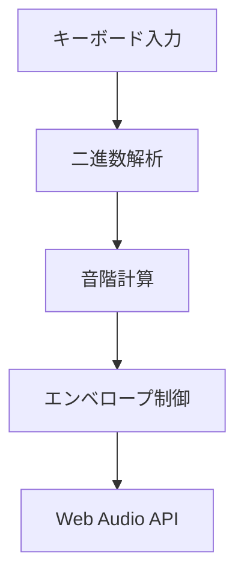
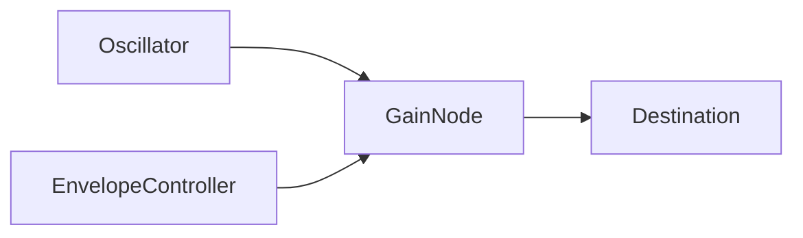

# 技術仕様

音響システムの技術的な仕様を説明します。

## アーキテクチャ



## 処理フロー

### 1. 入力処理
- キーイベント捕捉とバリデーション
- 二進数パターン抽出（A,S,D,F → 4ビット）

### 2. 音階変換
```typescript
// メジャースケール変換
const scalePosition = binaryValue % 7;
const octave = Math.floor(binaryValue / 7);
const sharpOffset = hasSpaceKey ? 1 : 0;
```

### 3. エンベロープ制御
- **Attack**: 5ms
- **Decay**: 800ms  
- **Sustain**: 5%
- **Release**: 2秒
- **自動停止**: 1秒後にリリース開始

### 4. Web Audio API


## 主要クラス

### EnvelopeController
音量制御とフェードアウト効果を管理。

### useAudioContext
Web Audio APIの初期化と管理。複数発声キー（J,K,L）に対応。

## エラーハンドリング

- ブラウザ非対応: フォールバック表示
- リソース不足: 自動クリーンアップ
- 型安全性: TypeScript による完全な型保証