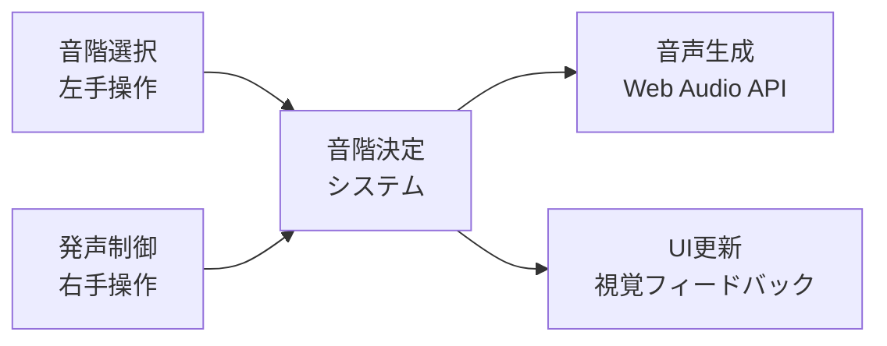
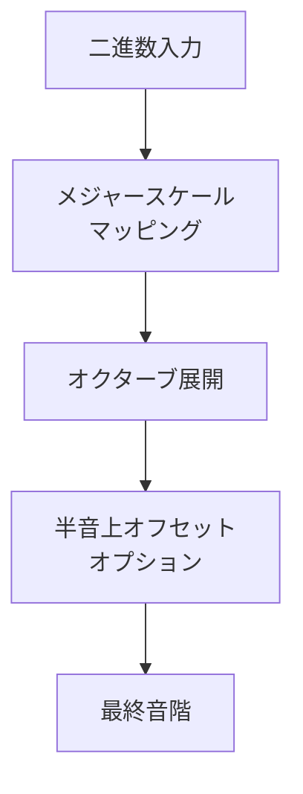
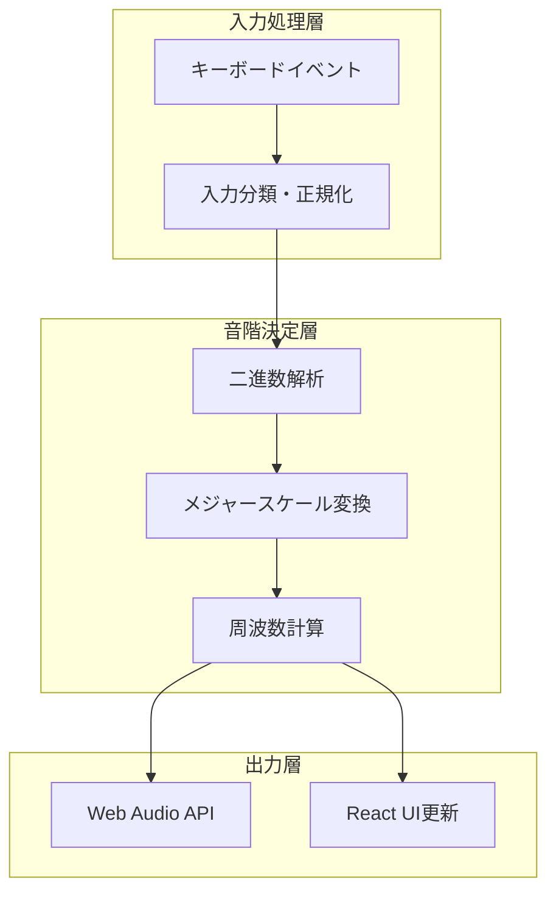

# デジタル楽器 - Binary Scale Instrument

二進数ベースの革新的なデジタル楽器システムです。左手で音階を選択し、右手で発声を制御する、直感的で効率的な演奏体験を提供します。

## 🎵 コンセプト



### 基本設計思想

- **分離された制御**: 音階選択と発声を独立して操作
- **二進数ベース**: 効率的な音階指定システム
- **メジャースケール重視**: 自然な音楽表現
- **半音階対応**: 完全な音楽的表現力

## 🎹 演奏システム

### 音階選択メカニズム
左手で**二進数パターン**を使用して音階を指定します：



- **基本音階**: メジャースケールの7音
- **オクターブ対応**: 複数オクターブに自動展開
- **半音階**: 追加入力で半音上の音階生成

### 発声制御
右手で音の発声タイミングを制御：
- **即座の応答**: 発声キー押下で即座に音が鳴る
- **音階切り替え**: 発声中でも音階変更が可能
- **クリーンな停止**: 発声キー離すと即座に停止

## 🏗️ システムアーキテクチャ



### 主要コンポーネント
- **音階決定エンジン**: 入力を音階に変換する純粋関数
- **オーディオ生成器**: Web Audio APIラッパー
- **状態管理**: React-based UI状態同期
- **視覚フィードバック**: リアルタイム演奏状態表示

## 🛠️ 技術スタック

- **フロントエンド**: React + TypeScript + Vite
- **オーディオ**: Web Audio API
- **開発環境**: pnpm + Biome
- **状態管理**: React Hooks
- **型安全性**: 完全なTypeScript対応

## 🚀 開発環境

### 必要条件
- Node.js 18+
- pnpm (推奨パッケージマネージャー)

### 基本コマンド

```bash
# 依存関係のインストール
pnpm install

# 開発サーバー起動
pnpm run dev

# ビルド
pnpm run build

# リンター
pnpm run lint
```

## 📚 技術ドキュメント

- [**AUDIO_FLOW_DOCUMENTATION.md**](./AUDIO_FLOW_DOCUMENTATION.md) - 詳細な技術アーキテクチャ
- [**CLAUDE.md**](./CLAUDE.md) - 開発ガイドラインと設計パターン

## 🎯 設計の特長

### 拡張性
- **プラグイン可能な音階システム**: 異なる音階体系への対応
- **設定ドリブン**: キー配置や音階マッピングの変更可能
- **モジュラー設計**: 各機能の独立性と交換可能性

### パフォーマンス
- **レイテンシー最適化**: 即座の音階切り替え
- **メモリ効率**: Web Audio APIの適切な管理
- **型安全性**: コンパイル時エラー検出

### ユーザビリティ
- **直感的操作**: 両手での自然な演奏感
- **視覚的フィードバック**: 演奏状態の明確な表示
- **学習容易性**: 二進数パターンの段階的習得

## 🔮 将来の拡張性

- **音色バリエーション**: 波形や音響効果の追加
- **録音・再生**: 演奏セッションの保存
- **ネットワーク演奏**: 複数プレイヤーでの協調演奏
- **MIDI連携**: 外部楽器との統合